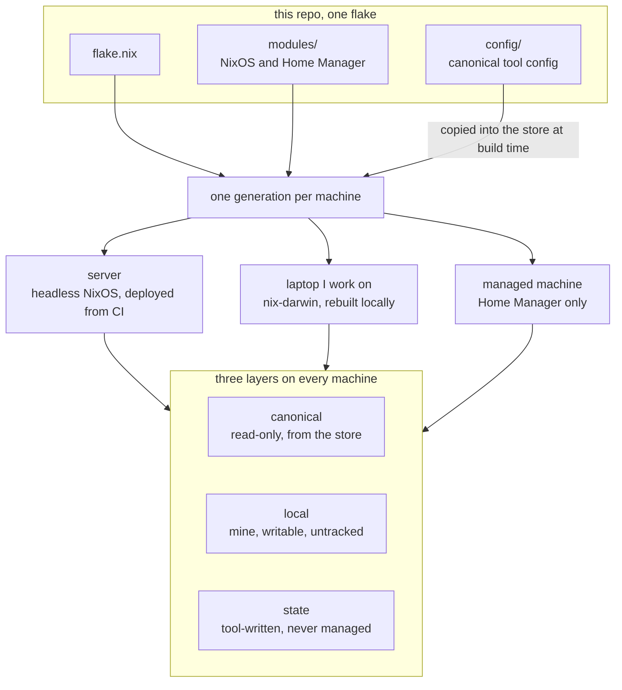

# RestartDK dotfiles

One flake describes every machine I run, and the tool config those machines read.



## The three layers

| Layer | Owned by | A change takes effect |
| --- | --- | --- |
| canonical | Nix, from `config/` | on rebuild or deploy |
| local | me, on the machine, untracked | immediately |
| state | the tool itself | never managed |

Nix owns the canonical layer, and a path Nix owns is never writable. The tool owns the state layer, and a path a tool writes is never managed. The local layer sits between them, and it is where work in progress goes without a rebuild and without a pull request:

```text
~/.config/zsh/local.zsh             sourced last by the generated zshrc
~/.config/nvim/lua/local/init.lua   loaded by config/nvim/init.lua
~/.agents/skills/<name>/            a local skill beside the canonical ones
<project>/.pi/settings.json         a project-scoped pi override
```

Directories that hold config are linked recursively, so the target is a real directory whose entries are store symlinks and a local file can sit beside them. `tests/live-checkout.sh` fails when delivered config reads the authoring checkout or reaches outside the store with an out-of-store symlink.

## Changing something

```bash
./bin/traitor re                            # rebuild this machine
./bin/traitor check                         # run the flake checks
./bin/traitor deploy <host> --remote-build  # deploy a host from here
./bin/traitor update                        # update the flake inputs
./bin/traitor rollback                      # go back one generation
```

Raw rebuilds work when the wrapper is not available:

```bash
sudo nixos-rebuild switch --flake .#<host>
darwin-rebuild switch --flake .#<host>
```

`hosts/` composes each machine and `nix flake show` lists them. A machine that only consumes config needs no checkout. `traitor sync` rebases a checkout on the machines that author it, and is run by hand.

## Where the rest lives

| Topic | File |
| --- | --- |
| CI, the deploy workflow, and the deploy account | [docs/deployment.md](docs/deployment.md) |
| Server install, disks, and runtime secrets | [hosts/srv-hatchi/INSTALL.md](hosts/srv-hatchi/INSTALL.md) |
| Pi key provisioning on the personal machines | [tests/personal-secrets.md](tests/personal-secrets.md) |
| The Home Manager bridge for a work repository | [docs/work-bridge.md](docs/work-bridge.md) |

## Rules

- Do not commit secrets, tokens, private keys, sessions, logs, caches, or generated state.
- Add new Nix files with `git add` before rebuilding; flakes only see tracked files.
- Put a machine-specific tweak in a local layer, never in a second copy of a tracked path.
