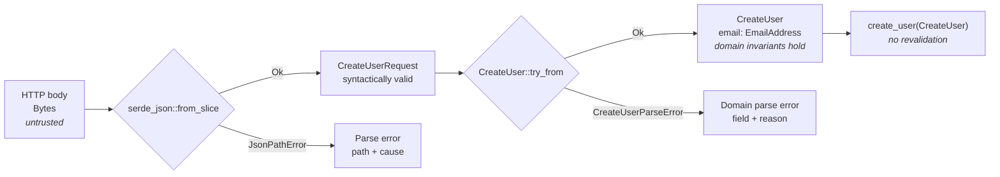
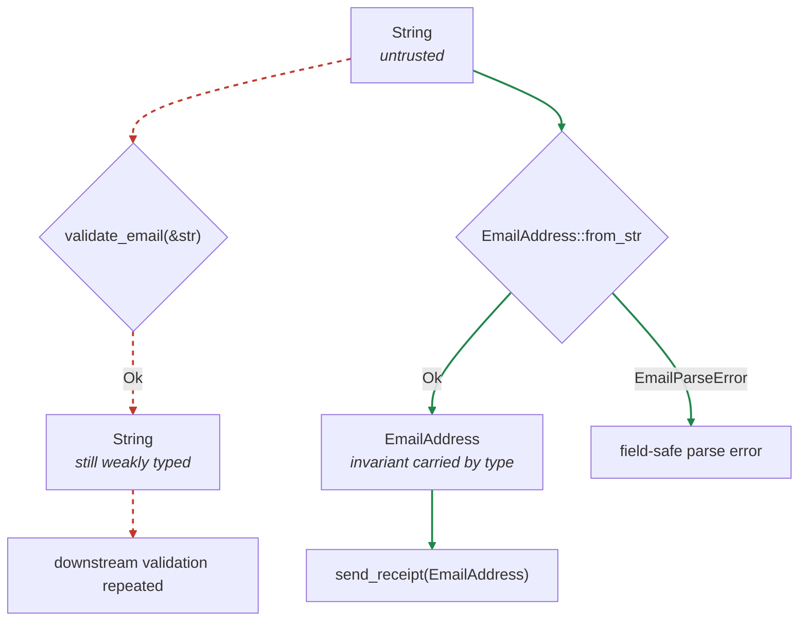

# Parse, Don't Validate

dstack wiring: an application of **principle-type-system-discipline** and **principle-boundary-discipline**; narrowing diagrams follow **principle-show-me**.

Lead with a Mermaid diagram. Show how data becomes narrower and more trustworthy as it crosses parsing boundaries. Keep accompanying prose brief.

## Inspect the path

When code is available, identify the actual:

1. ingress representation
2. syntax parser or deserializer
3. wire or transport type
4. domain parser or conversion
5. narrow domain type and its guaranteed invariants
6. business-logic consumer
7. error type at every fallible boundary

Use concrete file, function, field, and Rust type names. Mark missing information as unknown instead of inventing it.

## Draw the narrowing diagram

Use `flowchart LR` for a short pipeline and `flowchart TD` when error branches make a horizontal diagram too wide.

- Put representations in rectangular nodes.
- Put fallible parsing operations in diamond nodes.
- Label success edges `Ok` and rejection edges with the concrete error variant or type.
- State the new invariant inside each successful output node.
- Make every successful step produce a narrower type.
- End with business logic accepting the domain type without revalidation.
- Show syntax parsing and domain parsing as separate steps when they enforce different guarantees.
- Show the last known-good representation and failing parser when debugging an observed failure.
- Never include raw secret or credential values. Show their type and a redacted shape only.
- Keep the main success path to roughly 5–10 nodes. Omit unrelated calls and infrastructure.

Use this shape:



Adapt the labels to the code under discussion; do not repeat this generic example when concrete names are known.

## Diagnose validation-shaped code

Treat a check that returns the original weak type as a likely narrowing break:

```text
String -> validate(&str) -> String
```

Prefer a parser that returns evidence of the invariant in the type:

```text
String -> EmailAddress::from_str -> Result<EmailAddress, EmailParseError>
```

When this pattern exists, show the current and target paths in one Mermaid diagram. Use dashed red edges for the weak path and solid green edges for the narrowing path:



## Rust interpretation

Prefer standard parsing and conversion boundaries:

- `FromStr` for parsing one textual value
- `TryFrom<WireType>` for narrowing a transport type into a domain type
- typed `serde` deserialization for syntax and structural parsing
- constructors returning `Result<DomainType, DomainParseError>` when neither trait expresses the boundary clearly

A parser should return the narrowed value. An error should identify the parsing stage, safe field path, and underlying reason without logging the rejected secret value. Deserialize directly into a domain type only when the wire contract and domain representation intentionally coincide; otherwise show the wire DTO and domain conversion separately.

## Output

Return:

1. the Mermaid diagram
2. one short sentence naming the narrowing break or failed boundary
3. only when useful, a compact Rust signature showing the desired parser boundary

This skill owns Mermaid parse-narrowing diagrams. Use `show-me` as an additional skill only when the user asks for a broader visual explanation or an HTML artifact.
